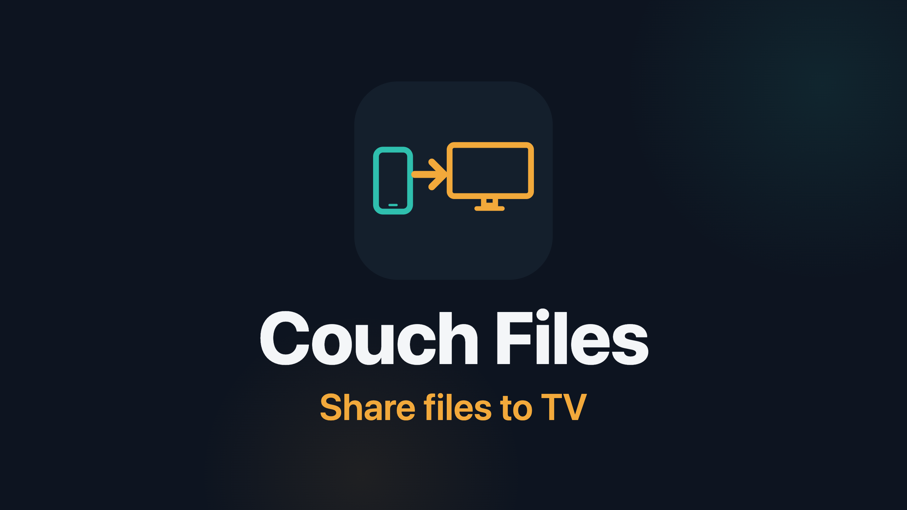
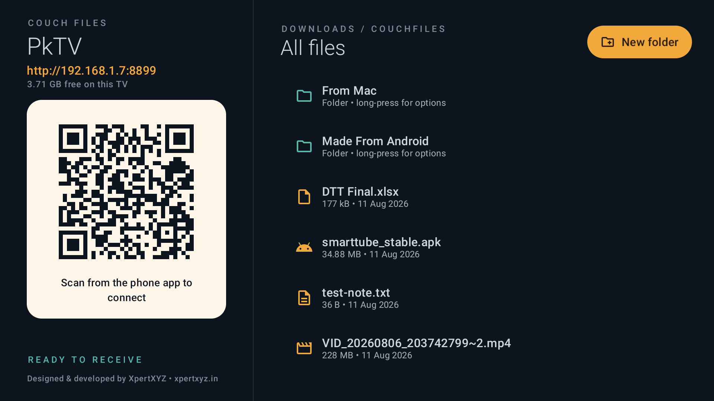
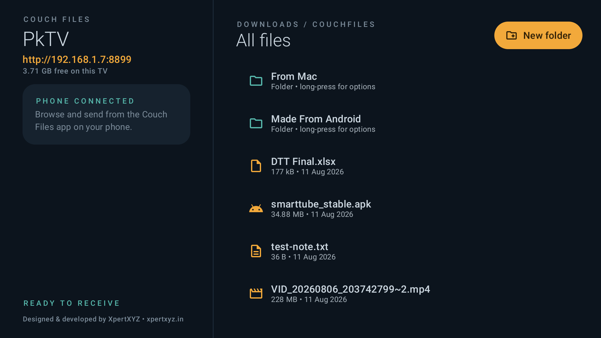
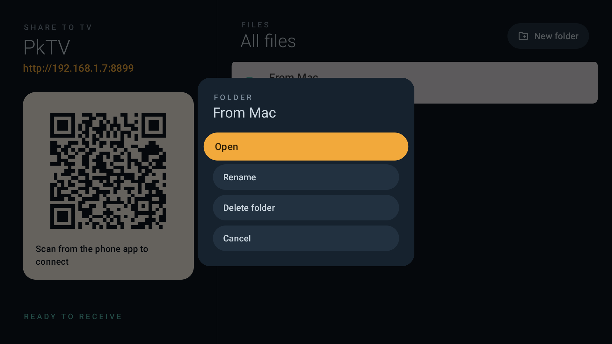
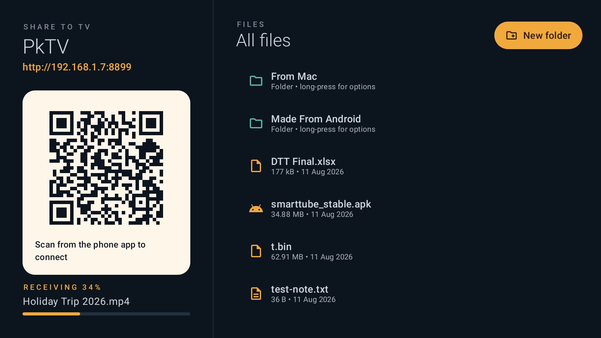
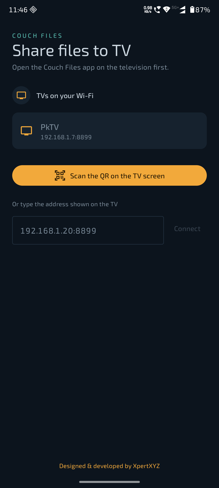
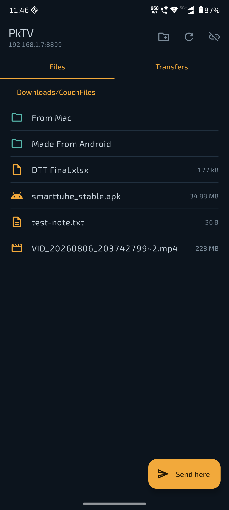
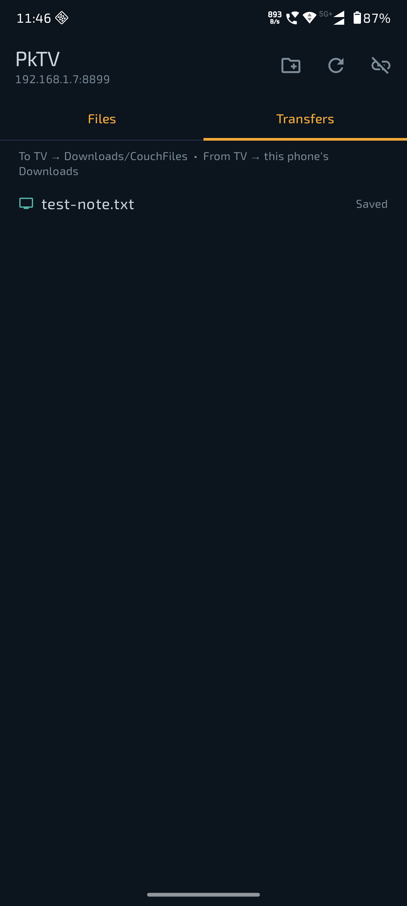
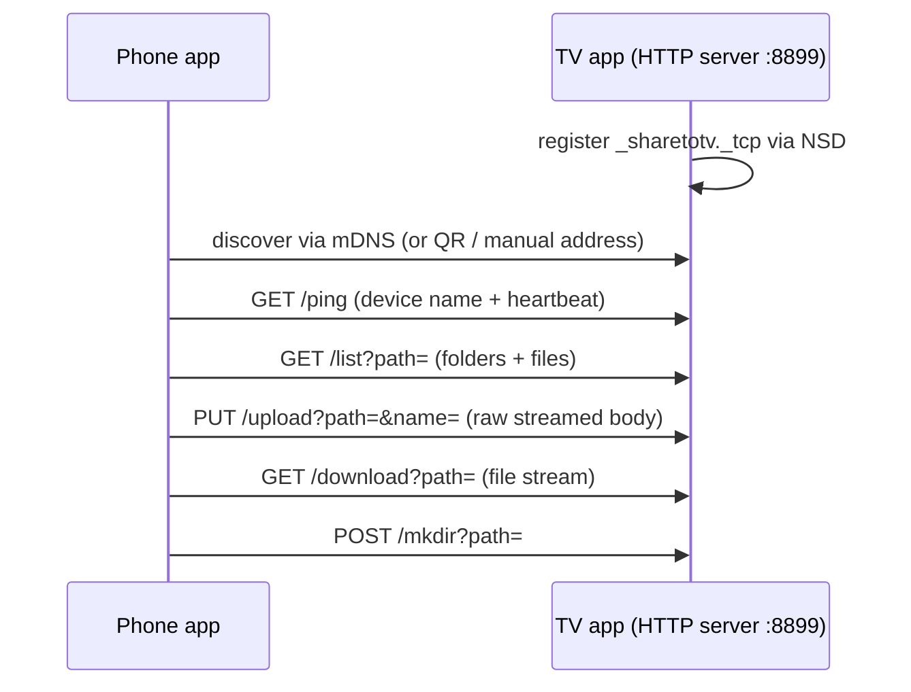

<p align="center">
  
</p>

# Couch Files

**Share files between your phone and your Android TV over local Wi-Fi — no cloud, no cables, no ads.**

Couch Files is a pair of Android apps: a **TV app** that receives files and doubles as a full
file manager, and a **phone app** that discovers the TV automatically, sends files (including
straight from the system Share sheet), browses the TV's storage, and pulls files back.
Everything travels over your own Wi-Fi network; nothing ever leaves your home.

> Built because the existing "send files to TV" apps on the Play Store were unreliable,
> ad-stuffed, or both.

---

## Features

### Phone app (`:mobile`)
- **Auto-discovery** — finds TVs running Couch Files on your Wi-Fi via mDNS/NSD, no setup
- **QR pairing** — scan the code on the TV screen when discovery is blocked by your router
- **Manual address entry** — type the `ip:port` shown on the TV as a last resort
- **Send anything** — multi-select via the system file picker, or share from any app
  ("Share → Couch Files"); no storage permissions needed
- **Browse the TV** — navigate the TV's folder tree, create folders, pick exactly where
  files land
- **Pull files back** — tap any file on the TV to save it into the phone's Downloads
- **Transfers tab** — live progress for every send and download, with a running count
- Screen stays awake while the app is open; disconnecting mid-transfer asks first

### TV app (`:tv`)
- **Zero-config receiver** — starts its server on launch and shows its name, address, QR
  code, and free storage
- **Real file manager** — browse, open, rename, delete files and folders with the remote;
  received files are organised into whatever folders the sender chose
- **Files land in `Download/CouchFiles/`** — visible to every file manager and media app
  on the TV (via MediaStore scanning), not locked inside an app sandbox
- **Open anything** — hands files to the right app (video player, gallery, package
  installer for APK sideloads) via FileProvider
- **Considerate by design** — QR hides while a phone is connected; deletes ask for
  confirmation; BACK asks before exiting during a transfer; double-BACK to exit

## Screenshots

| TV — ready to receive | TV — phone connected |
|---|---|
|  |  |

| TV — file options | TV — receiving |
|---|---|
|  |  |

| Phone — find your TV | Phone — browse the TV | Phone — transfers |
|---|---|---|
|  |  |  |

## How it works

The TV runs a small embedded HTTP server ([NanoHTTPD](https://github.com/NanoHttpd/nanohttpd));
the phone is a plain `HttpURLConnection` client. One server covers both directions — the
phone pushes with `PUT` and pulls with `GET`.



| Endpoint | Method | Purpose |
|---|---|---|
| `/ping` | GET | Returns the TV's device name; doubles as the connection heartbeat |
| `/list?path=rel` | GET | JSON listing of folders and files under the shared root |
| `/upload?path=rel&name=f` | PUT | Raw request body streamed to disk (`Content-Length` required) |
| `/download?path=rel/f` | GET | Streams a file back |
| `/mkdir?path=rel/new` | POST | Creates a folder |

Safety properties of the transfer path:

- Every path is canonicalised and **jailed to the shared root** — traversal attempts get `403`
- Uploaded filenames are sanitised; collisions get ` (1)`-style suffixes, never overwrites
- Uploads stream to a `.part` file and rename on completion — a dropped connection never
  leaves a half-written file in the listing
- The QR encodes `sharetotv://connect?host=…&port=…&name=…`

## Where files live

| Direction | Destination |
|---|---|
| Phone → TV | `Download/CouchFiles/<folder you picked>` on the TV |
| TV → Phone | The phone's `Downloads` via MediaStore |

On TVs below Android 11 the app falls back to its private storage
(`Android/data/…/files/SharedFiles`), since public-storage write access isn't grantable there.

## Building

Requirements: JDK 17+, Android SDK. The Gradle wrapper handles the rest.

```bash
./gradlew assembleDebug          # builds both APKs
./gradlew :tv:testDebugUnitTest  # server path-safety unit tests

# install
adb connect <tv-ip>:5555 && adb install tv/build/outputs/apk/debug/tv-debug.apk
adb install mobile/build/outputs/apk/debug/mobile-debug.apk
```

Both modules share the application id `com.xpertxyz.sharetotv` — on the Play Store they
ship as one listing with a phone AAB and a TV AAB.

## Permissions, explained

| App | Permission | Why |
|---|---|---|
| both | `INTERNET` | Local sockets — the server on the TV, the client on the phone |
| phone | `CAMERA` | Only for the QR scanner, requested when you tap Scan |
| TV | `MANAGE_EXTERNAL_STORAGE` | Makes the TV a real file manager: received files go to public Downloads where every app can see them (one-time grant on first launch) |
| TV | `REQUEST_INSTALL_PACKAGES` | "Open" on a received APK can launch the package installer (sideloading) |

No analytics, no tracking, no network calls beyond your own Wi-Fi. The phone app declares
`usesCleartextTraffic` because transfers are plain HTTP between your own devices on your LAN.

**Note for Play Store forks:** `MANAGE_EXTERNAL_STORAGE` and `REQUEST_INSTALL_PACKAGES`
are restricted permissions that require declarations during Play review.

## Project structure

```
├── mobile/                 # Phone app (Jetpack Compose, Material 3)
│   └── …/sharetotv/
│       ├── MainActivity.kt # Connect screen, TV browser, transfers, share-sheet target
│       ├── TvClient.kt     # HttpURLConnection client for the TV's server
│       └── TvDiscovery.kt  # mDNS/NSD discovery
├── tv/                     # TV app (Jetpack Compose for TV, tv-material)
│   └── …/sharetotv/
│       ├── MainActivity.kt # Rail (QR/status/storage) + file manager UI
│       ├── FileServer.kt   # NanoHTTPD server: list/upload/download/mkdir, path jail
│       └── Qr.kt           # QR bitmap generation (zxing-core)
└── docs/                   # Screenshots and artwork used by this README
```

Dependency count is deliberately tiny: NanoHTTPD (server), zxing-core (QR render),
zxing-android-embedded (QR scan), and Jetpack/Compose. HTTP client, JSON, and discovery
all use what Android ships with.

## Known limitations

- **No authentication** — anyone on your Wi-Fi can push/pull files while the TV app is
  open. Fine for a home network; a pairing PIN is the natural next step.
- Transfers pause if the phone app goes to background (no foreground service yet).
- The TV can't push to the phone on its own — the phone pulls instead, which keeps the
  TV free of a file picker.

## Credits

Designed & developed by [XpertXYZ](https://xpertxyz.in).

## License

To be decided before public release — GPL-3.0 is the working plan (keeps forks open-source).
